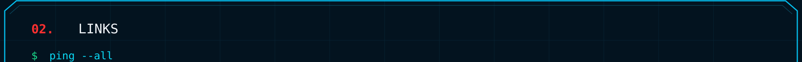
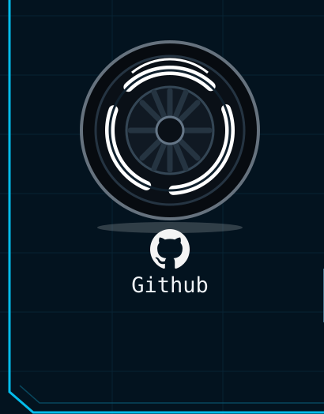
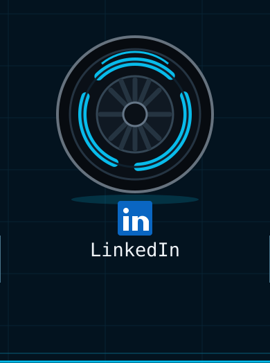
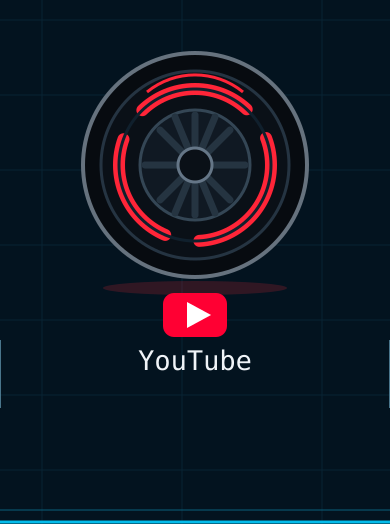
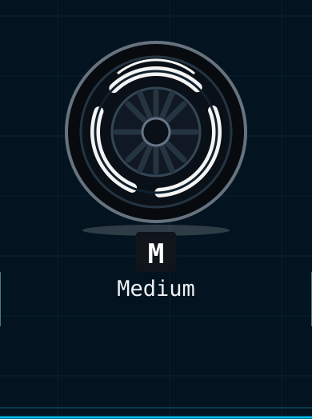
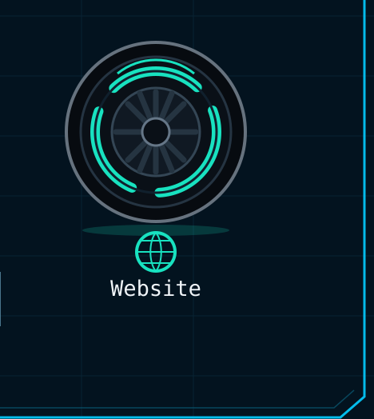

  
    
  

  

<!-- 

# Hi 👋, I'm Renato Francia

### Digital Craftsman 

- 🔭 I'm currently working on **Drupal (modules, courses, tutorials), Cybersecurity (Security+, tryhackme), AWS(Cloud Practicioner, AI Practicioner) and Machine Learning. **

- 🌱 I'm currently learning **Kali Linux, Drupal 11+, Laravel (Laracasts), Python (Boots.dev) and MIT (Discrete math) **

- 👯 I'm looking to collaborate on **Open source projects (Drupal, Laravel, Cybersecurity, ML) **

- 🤝 I'm looking for help with **Learning system design and software architecture. **

- 💬 Ask me about **Drupal, Node, python, Cybersec and Machine Learning. **

- ⚡ Fun fact **I like code and coffee. Huge Star Wars Nerd. **

- 👨‍💻 All of my projects are available at **[https://codewithnacho.com/](https://codewithnacho.com/)**

- 📝 I regularly write articles on **[https://medium.com/@rmfranciacastillo](https://medium.com/@rmfranciacastillo)**

- 📄 Know about my experiences **[https://drive.google.com/file/d/1roZRPLw_Yt4zuAszjv-KlrUjKfmgX-Ro/view?usp=drive_link](https://drive.google.com/file/d/1roZRPLw_Yt4zuAszjv-KlrUjKfmgX-Ro/view?usp=drive_link)**

<h3 align="left">Connect with me:</h3>

<h3 align="left">Languages and Tools:</h3>

                                     

-->
