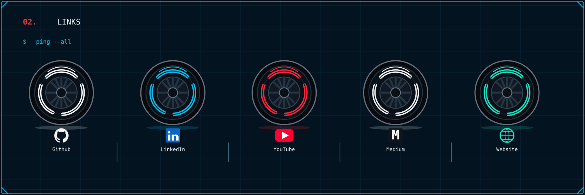
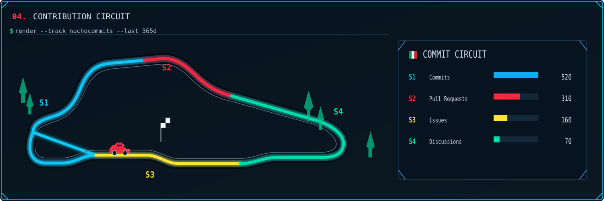
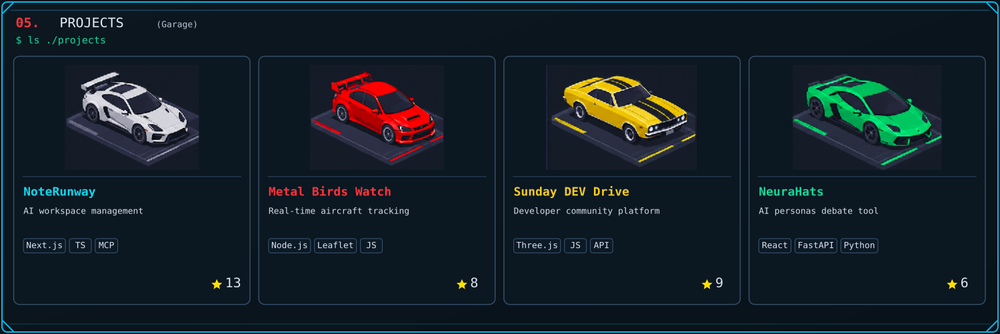
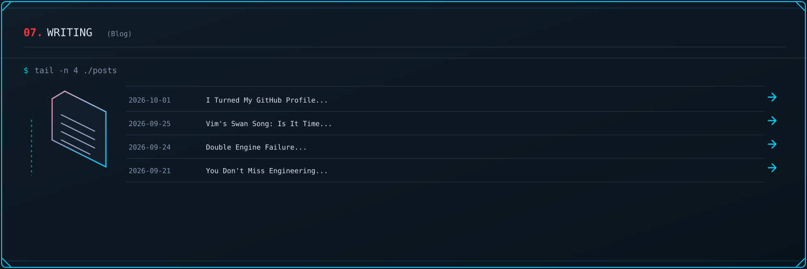

  
  
  
  
  
  
  

## YouTube — Latest

Watch my latest videos on software development, backend engineering, and technology.

<!-- BEGIN YOUTUBE-CARDS -->
<!-- END YOUTUBE-CARDS -->

I'm a backend-focused software engineer specializing in **PHP, Drupal, WordPress, and Laravel**. I build web applications, content management systems, backend integrations, and developer tools, with growing interests in **artificial intelligence, cybersecurity, cloud engineering, and open-source software**.

My engineering approach prioritizes maintainable architecture, reliable backend systems, automation, and practical solutions to complex technical problems.

## What I Work On

I focus on backend engineering, PHP ecosystems, Drupal and WordPress development, application architecture, developer productivity, and practical exploration of AI and cybersecurity.

For professional opportunities, collaborations, or technical discussions, connect with me on [LinkedIn](https://www.linkedin.com/in/renatofrancia/) or visit [codewithnacho.com](https://codewithnacho.com/).